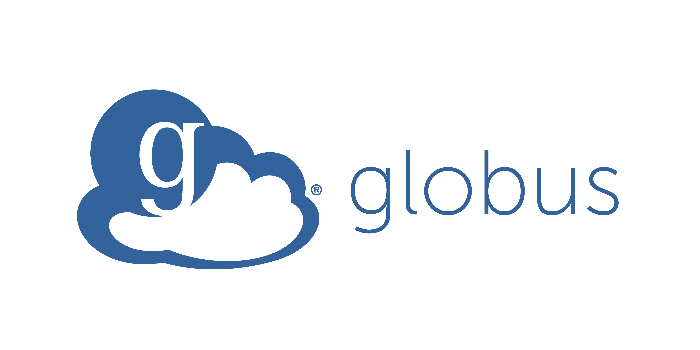

# Globus Compliance Portal

Welcome to the Globus Compliance Portal. This site provides a centralized location for compliance documentation, policies, and resources related to Globus services and data management practices.

---

## About This Portal

This portal is designed to support teams working with Globus by offering:

- Clear access to compliance and policy information  
- Documentation relevant to data handling and security  
- Links to authoritative Globus resources  
- A structured place to grow internal compliance materials  

As the portal evolves, additional sections and pages will be added to support your workflows.

---

## Getting Started

Use the navigation menu to explore available documentation.  
If you need access to Globus services, authentication, or transfer capabilities, you can sign in using the button in the upper right corner.

---

## Additional Resources

- **Globus Privacy Policy:** https://www.globus.org/legal/privacy  
- **Globus Terms of Service:** https://www.globus.org/legal/terms  

If you have questions or need support, please reach out to your compliance or security contact.
